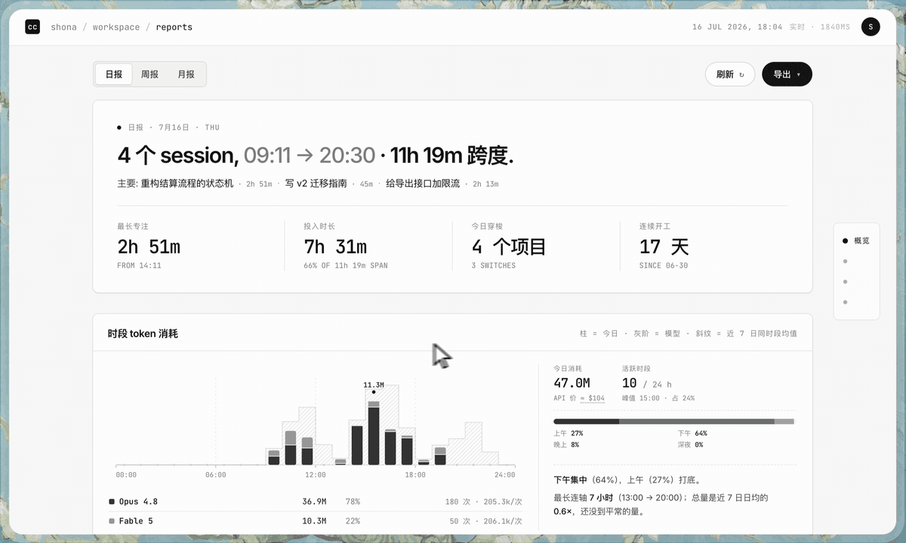
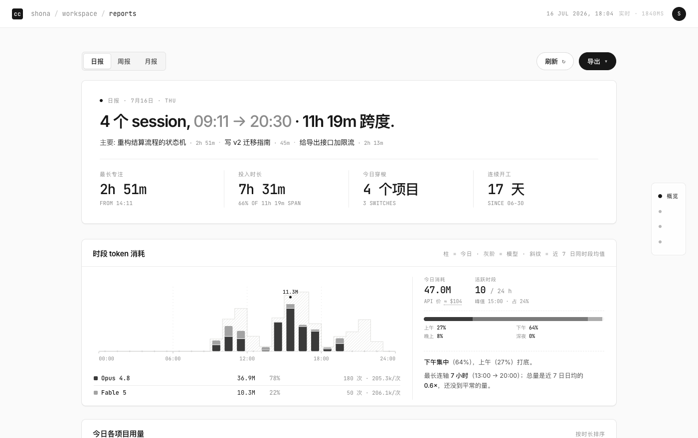
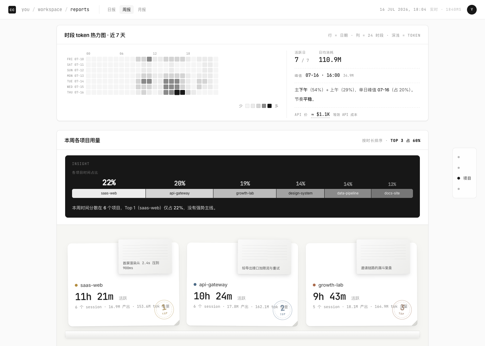
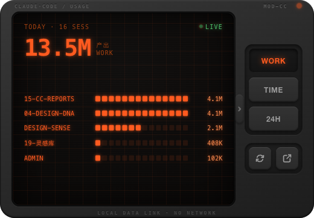
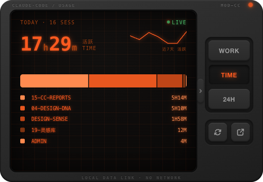
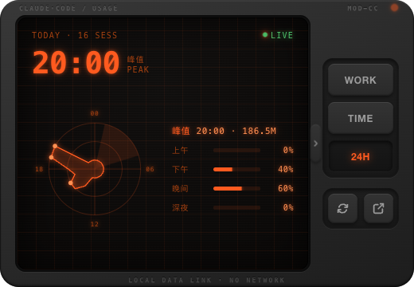

# cc-reports · Claude Code 日报 / 周报 / 月报
### 把你每天用 Claude Code 干的活，显影成一张日历

by 布灵布灵灵 · [小红书](https://xhslink.com/m/1ht5s0trmNo) · [GitHub](https://github.com/pxx-design)

---

## 这个工具解决什么问题

用 Claude Code，经常同时开好几个会话、跑不同项目，很好奇每轮会话、每个项目到底用了多少时间，烧了多少 token。cc-reports 把它显影成一张点击就重算的日历：今天、这周、这个月，一眼看清。

这像是一本工作日历。



> 全站配图与动图均为**演示数据**（项目名 `01-saas-web` 之类都是编的）。你自己的报告只在本机生成，不经过任何服务器。

---

## 它给你看什么

**日报**



- **四个里程碑**：最长专注（最长的单段 session）· 投入时长（各 session 活跃时长之和，标出它占今天跨度多少）· 今日穿梭（碰了几个项目、切换几次）· 连续开工（到今天没断几天）
- **时段 token 消耗**：24 根柱子按模型堆叠，背后那层斜纹是**你近 7 日同时段的常态**——今天是高出常态还是塌下去，一眼可读。右边跟着一栏解析：上午/下午/晚上/深夜占比、峰值时段、今天总量是日均的几倍。点柱子看那一小时的模型分布。
- **各项目用量**：先一条时间占比条（今天的时间怎么分给了几个项目、有没有主线），再是项目卡——主指标是**活跃时长**（时间＝心思落在哪），卡上那张便签是这个项目最近一次 session 的标题。
- **今日 Sessions**：每个 session 的标题、时长、token；实时模式下点开可以下钻看这轮到底做了什么。
- **等效 API 成本**：`≈ $xxx` 可以点开，按模型列出四类 token 的「量 × 单价 = 小计」。这是**按官方价目表折算的等效成本，不是订阅实付**（订阅制下拿不到真实账单），所以永远带一个 `≈`。

**周报 / 月报**

- 时段图升级成 **天 × 24 小时的热力图**，点格子看那个时段的模型分布；右边一栏解析你的作息节奏（时段分布、单日峰值、爆发型还是平稳型、最长连续活跃）。
- 里程碑变成"这段时间之最"：最长专注在周几、最晚的一晚熬到几点、哪天穿梭了最多项目。



跨天的长 session（有时候会不关窗口连着用好几天）会被按日切开，每天的数字是"那天做了什么"，不是"这个 session 从哪天开的"。所以它是一本工作日历，不是一份 session 流水账。

### 一个诚实的口径：产出 ≠ 总量

token 总量里约 **90% 是 `cache_read`**——每轮对话重读上下文产生的，随会话变长而 N² 膨胀。拿它当"你干了多少活"会严重误导：一个开着不关的长会话，看着比谁都高产。

所以这里分两把尺子：**项目卡按活跃时长排序、量指标用产出（output + cache_creation）**，总量只作小字附注；**时段柱子画的是当小时的总消耗**（含 cache_read）——那是真实流过的量，也是折算成本的依据。哪个数字是什么，页面上都标着，不混着说。

---

## 它和别的 cc 用量工具差在哪

市面上的工具大多在拼"多少"——token、成本、燃烧率。cc-reports 只认一件别人不太管的事：你**怎么用**。

| | 查额度 / 用量的工具 | cc-reports |
|--|--|--|
| 核心问题 | 花了多少 token、还剩多少额度 | 每天用它做了什么 |
| 时间粒度 | 当前周期 / 累计总量 | 按天切片的工作日历 |
| 项目归属 | 一般没有 | 自动认出每天在哪个项目干活 |
| 跨天长 session | 整段算在起始那天 | 按日切开，每天各算各的 |
| 时段节奏 | 一般没有 | 24 小时 × 模型 分布 |
| 运行 | 视工具而定 | 100% 本地、不联网、纯 Python 标准库 |

---

## 值不值得你用

**最适合：**
- 每天重度用 Claude Code、想知道时间和 token 花在哪的人
- 同时开好几个项目、想看每个项目各占多少的人
- 想留一份"我用 AI 做了什么"的可回看记录的人

**不太适合：**
- 只想看"还剩多少额度"——官方 `/usage` 更直接
- 想要实时燃烧率加限额预测——有专门工具（如 Claude-Code-Usage-Monitor）

---

## 谁能用 · 怎么装

一个 Python 内核，三种用法。先看你的平台能用哪些：

| 用法 | 它是什么 | 谁能用 | 怎么装 |
|---|---|---|---|
| **日报网页** | 浏览器里点一下就重算的用量日历 | **全平台**：macOS / Linux / Windows，有 `python3` 就行 | `git clone` + 一条 python 命令（零依赖、不编译） |
| **桌面浮窗 cc-glance** | 常驻菜单栏的迷你终端，随时瞟一眼今天用量 | **仅 macOS 13+**（原生菜单栏 app，装时从源码编译） | `brew install`（升级 `brew upgrade`、卸载 `brew uninstall`） |
| **Claude Code skill** | 在对话里直接问「我这周用了多少」 | 装了 Claude Code 的人（任何平台） | 软链进 `~/.claude/skills/` |

> 浮窗只能 macOS——不是刻意限制，是它本身就是「菜单栏 app」，而菜单栏这个东西 Windows/Linux 没有。那两个平台的用户走**日报网页**那一面，功能一样全。三种用法互不依赖，只装你要的那种即可。

### 日报网页（全平台）

零依赖，纯 Python 标准库，不用编译：

```bash
git clone https://github.com/pxx-design/cc-reports
cd cc-reports
python3 cc-reports.py serve      # Windows 上命令是 python
# 打开终端里提示的那行 URL（8765 被占会自动往后找，别写死）
```

> Windows 逻辑上跑得通，但暂未在真机验证过。

### 桌面浮窗 cc-glance（仅 macOS 13+）

```bash
brew tap pxx-design/cc-reports https://github.com/pxx-design/cc-reports
brew install cc-glance           # 从源码编译，需 Xcode / Command Line Tools，首次两三分钟

cc-glance                        # 跑起来 → 菜单栏出现图标（⌥⇧R 开合浮窗）
brew services start cc-glance    # 想开机自启再跑这个
```

**菜单栏图标就是这个进程本身**——它不往系统里注册任何东西（不进 `/Applications`、没有 `.app`、系统设置里找不到）。进程活着图标才在，退出就没；所以「开机自启」的本质是「让进程一直活着」。装完的 `cc-reports` 命令能顺手起日报网页（`cc-reports serve`）。

### Claude Code skill

装好后在任意目录说一句「看我的 cc 日报」，它自己起服务开页面；也能直接回答「我这周在 X 上花了多久」，或在项目归类不对时跑 `doctor` 帮你修 `config.json`。

```bash
# macOS / Linux：软链进 skills 目录，以后 git pull 就更新
ln -s "$(pwd)" ~/.claude/skills/cc-reports

# Windows：把整个文件夹复制进 %USERPROFILE%\.claude\skills\cc-reports\
```

不想装也行：对着 clone 下来的目录说「读 ./SKILL.md，帮我生成 cc 报告」，一样能跑。

---

## 浮窗 cc-glance 长什么样

不想开落地页、只想随时瞟一眼今天的用量?`menubar/` 里有一台常驻桌面的迷你终端——复古 CRT 设备造型,琥珀磷光屏,原生 Swift 编写,零第三方依赖。装法见上面「[谁能用 · 怎么装](#谁能用--怎么装)」。

| WORK · 比产出 | TIME · 分时间 | 24H · 作息节奏 |
|---|---|---|
|  |  |  |

- **三视图**(右侧物理按键切换):WORK 项目分段 LED 电平表 · TIME 总时长+频谱分配条+近7天折线 · 24H 雷达图看今天几点在干活
- **口径诚实**:主数字是「产出」(output + cache_creation),不是被缓存重读灌水的 total
- **交互**:`⌥⇧R` 全局开关浮窗 · 拖上下丝印带移动(位置记住) · 抽屉把手收起按键列只留屏幕 · 点 LED 熄屏 · 丝印带右键退出
- **数据同源**:`cc-reports.py glance` 出精简 JSON,和 dashboard 一个内核,同样不联网

### 框沿上的桌宠

浮窗顶沿坐着一个像素小人。她不是装饰动画——**状态由你真实的 token 流驱动**：

- **猛干**（≥30 万产出/小时）→ 埋头敲电脑
- **回血**（刚忙完那阵）→ 端着奶茶歇着
- **闲置**（20 分钟没动静）→ 趴着睡，头上飘 Zz
- **里程碑**（当日产出跨过 1M / 2M / 5M / 10M / 20M）→ 起身欢呼，火星雨落屏

奶茶会随时间喝完，**双击她可以续杯**。切换状态时她会下蹲、起跳、落地扬起尘土，不是硬切帧。

> 上面三张视图截图摄于桌宠上线之前——现在窗口顶沿多了这位小人，其余不变。

从源码跑（开发 / 改代码时，不走 brew）：

```bash
cd menubar
./run.sh                    # 构建并启动
./run.sh stop               # 停
```

---

## 项目识别 / 配置

每个 session 的文件路径都相对它的**启动目录（launch anchor）**解析——就算你中途 `cd` 进某个子目录直接改文件，也照样算回那个子目录所属的项目，不会掉进 "root files"。`/tmp`、scratchpad 等临时产物不参与归类。在此之上按五层优先级判定：

0. **`session_overrides`**（最高）：把某个 sessionId 钉死成项目名（应付跨天在多个项目间跳的会话）
1. **`cwd_overrides`**：把某个绝对路径映射成项目名（先查 anchor，再查当前 cwd）
2. **单项目根**：anchor/cwd 里有 `package.json` / `Cargo.toml` / `pyproject.toml` 等构建清单，就用目录名当项目名（`.git` 单独存在不算，很多 workspace 也用 git）
3. **多项目 workspace**：看这个 session 里 Edit / Write 最多的**真实项目**第一级子目录；兜底桶（root files / claude-config 等）不参与竞选，只在真项目零票时垫底
4. 完全没有文件操作 → "general"

默认体验够用——大多数布局第 2/3 步就认对了。想自定义就把 `config.example.json` 复制成 `config.json`，改完在浏览器点「刷新」即可生效，不用重启。

### 分错了怎么办

如果浮窗顶部亮起 `⚠ N% 产出未归类`，或你觉得某天数字不对，跑一条命令自查：

```bash
python3 cc-reports.py doctor          # 近 7 天，列出落进兜底桶的大额会话
python3 cc-reports.py doctor --days 30 --min-work 500000
```

它会指出哪些会话疑似漏归类、猜出真实项目，并直接吐出可粘进 `config.json` 的 `cwd_overrides` / `session_overrides` 规则行——不用手翻日志。

---

## 隐私

- **100% 本地**：只读 `~/.claude/projects/*.jsonl` 和你 clone 的模板
- **不联网**：服务只监听 `127.0.0.1`，不对外开放
- **数据不离开你的电脑**：除非你自己截图分享，或把生成的 HTML 发出去
- 你的 `config.json`（含项目别名，可能透露内部代号）默认在 `.gitignore` 里，不会被提交

---

## 文件结构

```
cc-reports/
├── README.md             你正在看的这份
├── SKILL.md              Claude Code skill 协议（起网页 / 答用量问题 / 修分类）
├── cc-reports.py         CLI：build / serve / glance / doctor
├── cc-reports.html       dashboard 模板（数据通过 fetch 加载）
├── cc_usage_core/        内核：jsonl 扫描 + 模型/定价注册表（纯标准库）
├── menubar/              cc-glance 桌面浮窗（macOS · Swift · CRT 终端造型 + 桌宠）
├── Formula/              Homebrew formula（brew tap 用）
├── assets/               README 配图
├── config.example.json   配置模板
├── .gitignore
└── LICENSE
```

运行后会生成 `config.json`（你的私有别名表）和 `cc-reports-data.json`（数据快照），两者都已 gitignore。

---

## 兼容性

- **Python** 3.9+（纯标准库，无第三方依赖；3.9.6 实测跑通 build / serve / glance / doctor）
- **日报网页**：macOS / Linux 实测可用；Windows 逻辑上可用（命令用 `python`，装 skill 用复制而非 `ln -s`），未在真机验证
- **桌面浮窗**：仅 macOS 13+，需 Xcode / Command Line Tools（从源码编译）
- **浏览器**：Chrome / Safari / Edge / Firefox

---

MIT License · 自由使用修改分享，保留署名即可
